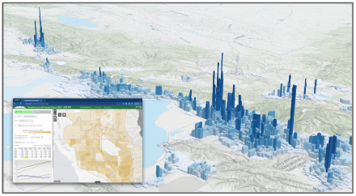

# REMM-v3.0

Real Estate Market Model: Where Will We Live and Work in the Future

The Real Estate Market Model (REMM) relies on best available resources to project future residential and employment-related development activity using the UrbanSim modeling platform. In order to accurately model future years, REMM is first calibrated to best reflect the base year of the adopted RTP, currently 2023. Critical inputs to REMM’s consideration of available land and profitability of new and redevelopment activity include:  

- A region-wide parcel land use and valuation database;
- An inventory of local government general plans;
- The results of a multi-year scenario-based visioning exercise;
- A synthesized household population dataset for the model’s base year (2019) based on Census data;
- Address geocoded employment totals from the Utah Department of Workforce Services (DWS);
- County-level employment and population control total projections, sourced from the University of Utah’s Kem C. Gardner Policy Institute;
- Public and private sector expert advisors; and
- ‘Physical constraint’ map layers that depict areas where future development is prohibited or not practical due to steep terrain, wetlands, mining, or public lands (formal designations or ownership).

These household and job distribution projections inform future trip generation in the regional TDM. And in turn, REMM factors travel accessibility derived from the travel model into its predictions of land development activity.  

Resources:  

[Model Documentation - Needs Updating!](https://docs.google.com/document/d/1zF3MWmOhru1-82TL6yOfIDP_rhoKDDRYtqSdHP4eJcQ/edit?tab=t.0)  
[Installation Instructions](https://docs.google.com/document/d/1QW1MMaRt1T9WUiNs4Ig9TdYE77BgdEVSFF-uPRnV2rk/edit)  

